---

## Project: Perception Pick & Place
In this project I implemented a processing chain to perform object recognition based on RGB-D data provided as a point cloud from the PR2 robots vision system.

First a preprocessing chain is set up to filter and segment the point cloud data into objects of interest.
Based on the resulting point cloud clusters, features are calculated describing various properties of the objects to recognise. These features are used to train a classifier in a supervised manner, which can then be used to recognise objects for the pick and place task.

---
### Perception preprocessing chain
#### Exercise 1 point cloud filtering and RANSAC plane fitting
The first preparation steps are 
- Statistical outlier filtering
    - required if data is noisy (always the case for real sensor data)
    - eliminates noisy measurements by assuming a minimum number of points within the local neighborhood of each point that should be kept
- Voxel grid filtering
    - reduces the number of points in the cloud by setting up a fixed voxel grid and sampling the given point cloud at those specified locations
    - makes operating with the point cloud computationally easier/feasible
    - enforces a fixed (therefore better predictable) point cloud density
- Passthrough filtering
    - clips the point cloud by tossing points outside of a minimum to maximum range along a specified axis 'x', 'y' or 'z'
- RANSAC plane segmentation
    - tries to fit the model of a given geometric shape (in our case a plane to detect the table top) to the point cloud such that a maximum amout of points are part of the model
    - yields a segmentation for model-inliers and -outliers

The follwing images illustrate these processing steps starting with a point cloud of fully loaded table top.

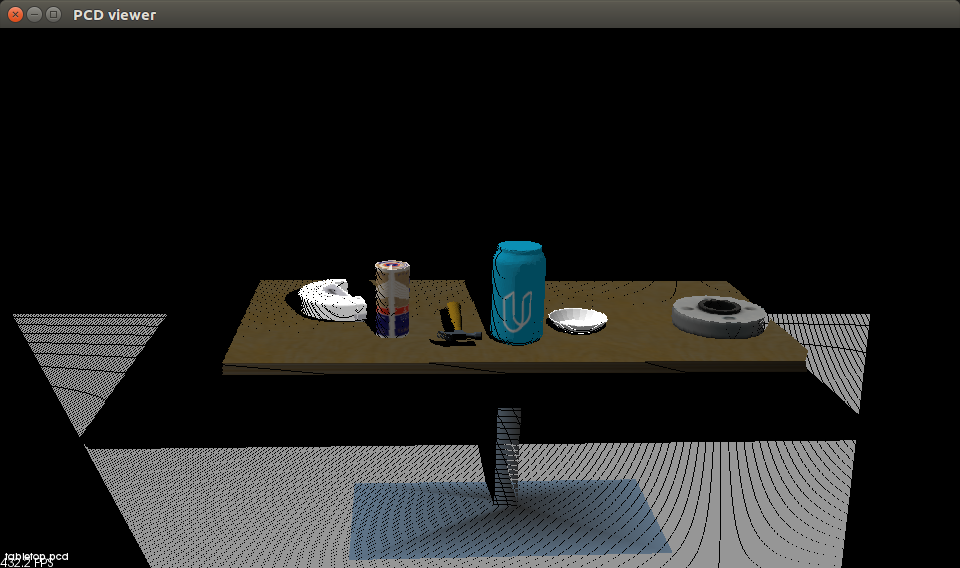

Voxel Grid Filtering reduces the number of points by sampling the cloud points at a fixed-size grid of voxels
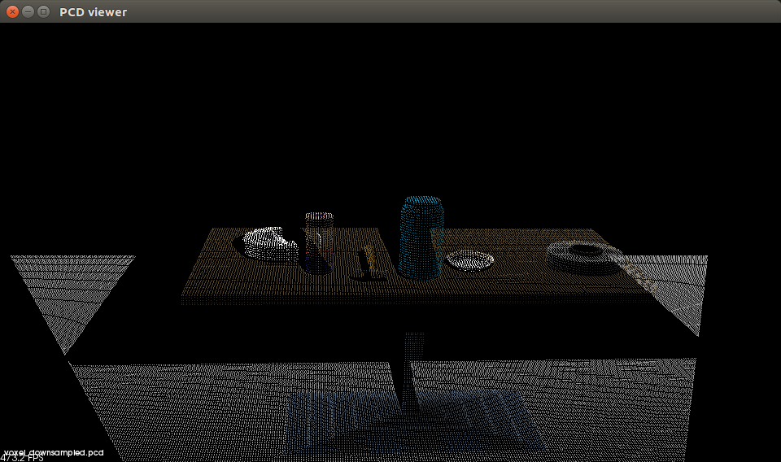

Passthrough filtering clips the point cloud to minimum and maximum z values.
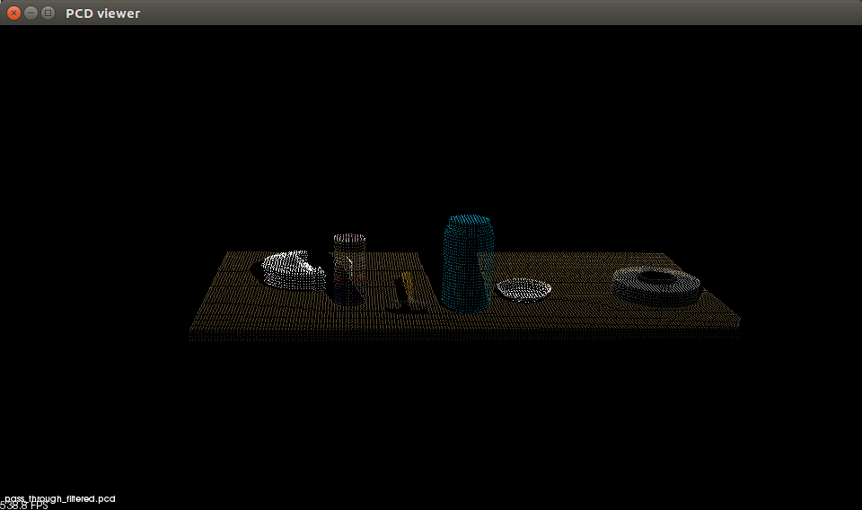

RANSAC plane fitting extracts the best model of a plane containing the highest consensus of points in the cloud.
The cloud is then separated into inliers (points part of the plane/table)
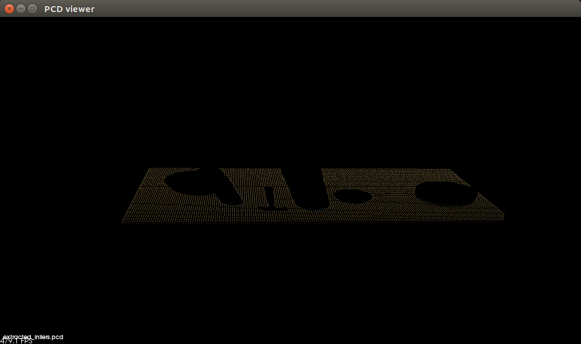
And outliers (points not part of the plane -> objects on the table)
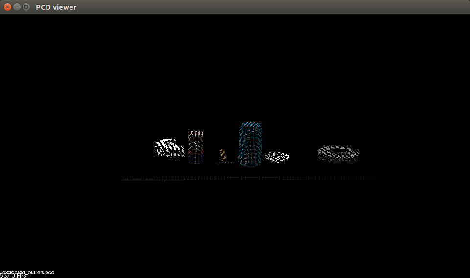

#### Exercise 2 point cloud clustering / object segmentation
Having separated the relevant parts of the point cloud from the noise, we can now try to cluster the remaining points into separate objects. 

In order to perform this task we use the euclidean clustering algorithm.
It is based on the assumption that neighboring points within a specified threshold radius belong to the same cluster. Once the amount of points within such a cluster lies between a minimum and maximum count, a cluster survives.
As long as objects that should be separated don't touch or come too close to each other, the algorithm is able to segment the point cloud into indiviual objects if correctly parameterized.

The image shows the clustering of objects seen by the PR2 robot in the pick and place setup.
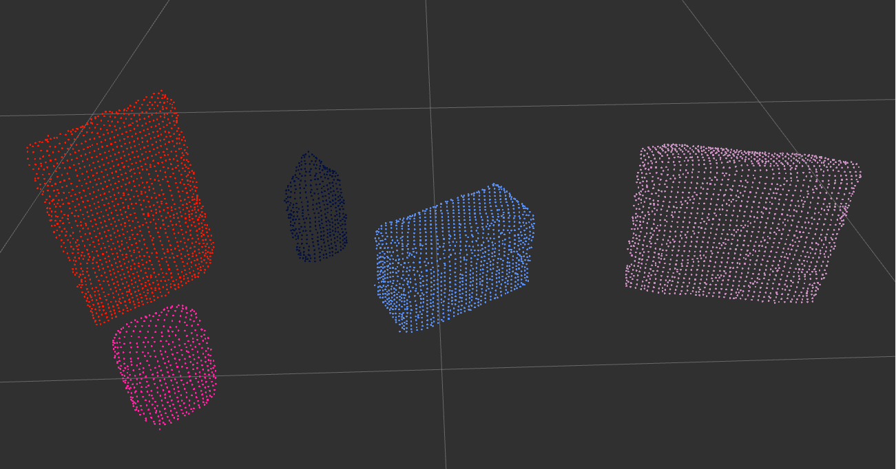

#### 2. Complete Exercise 3 Steps.  Features extracted and SVM trained.  Object recognition implemented.

Now that the point cloud is segmented into the objects of interested we can try to recognise them using a trained classifier.

Therefor a training setup is used to produce training data for the objects to recognise. The setup (depicted in the following image) just includes the RGB-D camera of the PR2 which is then presented with the objects to classify in various poses. For each pose the resulting point cloud is captured and features like the normalized color histogram of the points and the histogram of surface normals are recorded for the respective labeled object.
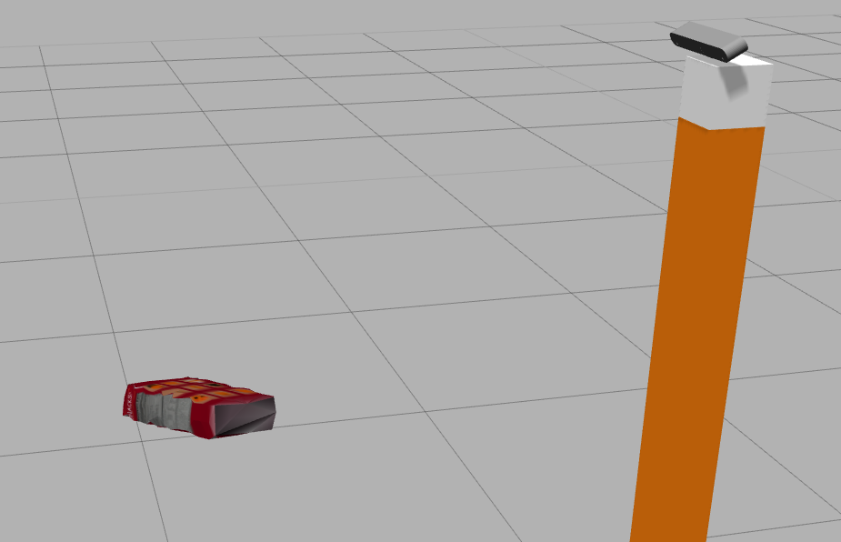

I gathered 154 labeled feature vectors for each of the 8 classes.
The acquired training data can then be used to train a classifier such as a SVM to perform the classification task.
Using a SVM with linear kernel the final predicition accuracy using 5-fold cross validation is approximately 93.83%.
The confusion matrix shows the classification accuracy for each class.
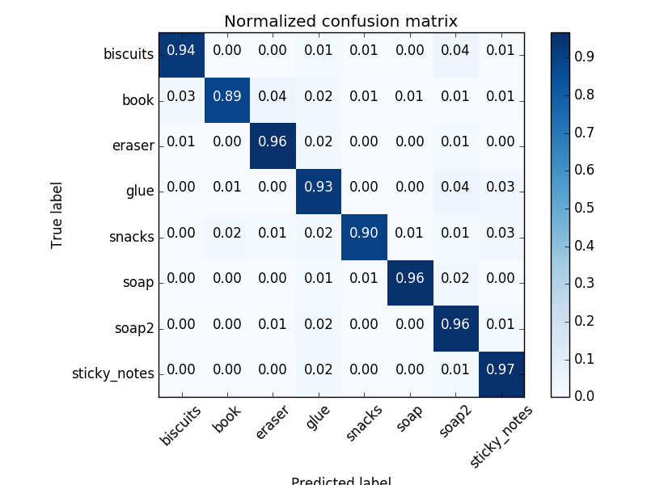
The usage of the classifier is demonstrated in the following pick and place setup.

---

### Pick and Place 

Using the previously described processing pipeline which is able to declutter, segment and classify objects from RGB-D data a pick and place task is implemented.

The different environments that were used to test the processing pipeline feature:
- world-1: 3 objects
- world-2: 5 objects
- world-3: 8 objects

Based on a specified pick list(order) and target dropboxes for each object in the environment the PR2 is supposed to receive pick and place instructions sequentially.
For each detected object it's centroid is calculated to determine its most obvious pick up position.
The search each object of the pick list in the detected objects and prepare a pick and place message consisting of:
- test_scene_num
- arm_name (which arm to use for the pick and place)
- object_name (label of the object to pick)
- pick_pose (pick up pose)
- place_pose (drop off pose in the corresponding dropbox)

These messages are gathered and jointly stored in an output{1-3}.yaml for each test environment. They can be used to instruct the PR2 to perform the pick and place task via a ros service interface.

In the world-1 environment the classification pipeline was able to correctly identify all 3 objects 'biscuits', 'soap' and 'soap2'.
When running the pick and place task the PR2 regularly managed to correctly place the objects in their respective dropboxes apart from the 'soap2' object where the pick up apparently doesn't grip firmly enough.
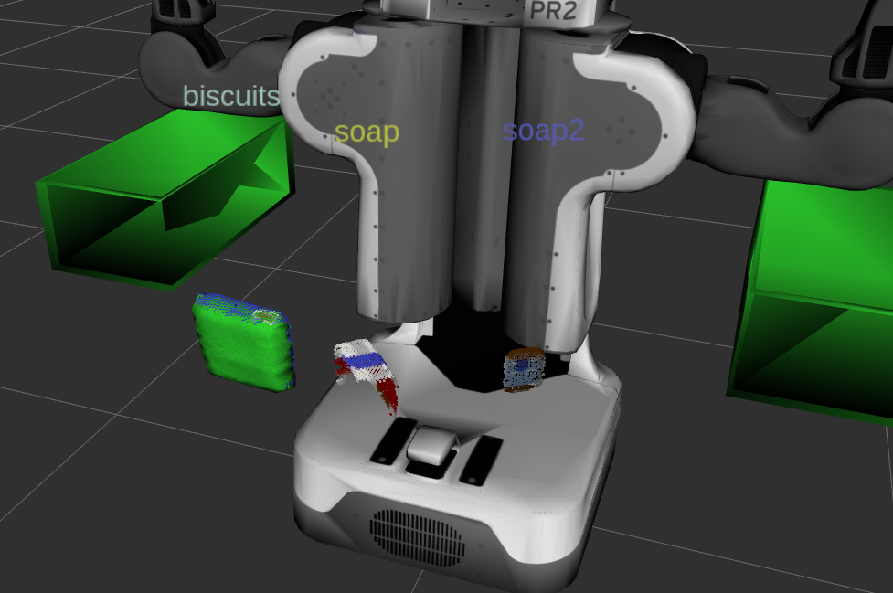

In the world-2 environment the point-cloud processing/segmentation also worked out and the classifier correctly recognised 4/5 objects. It missclassified the 'glue' object as 'biscuits'.
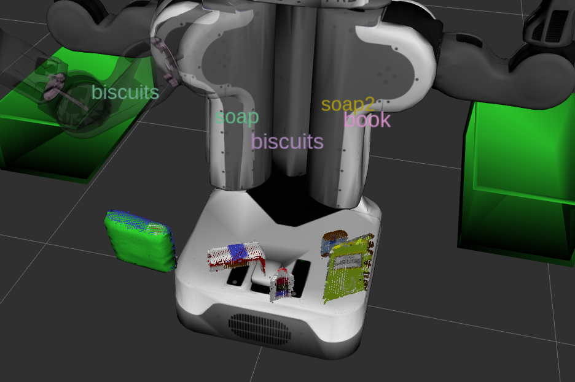

The world-3 environment already shows a pretty crowded table setup with 8 objects. The classification worked for 7/8 objects and again the 'glue' object was missclassified, in this case as 'sticky_notes'.
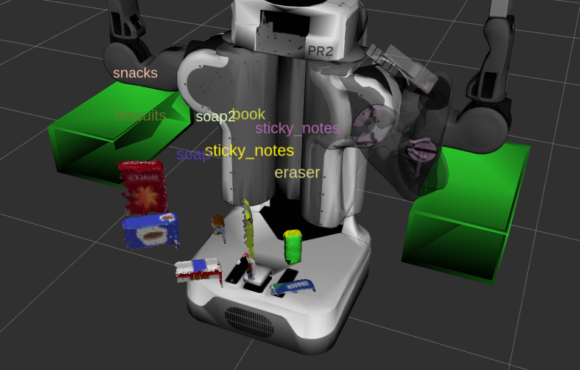

---
### Discussion

The point cloud processing chain works really good and produces stable results. It required quite some fine tuning to correctly parameterize all the applied filters for the setup but the result performs as expected.

Concerning the SVM classifier I'm mainly okay with the resulting model since in general it's able to correctly recognise the objects, but there are a definitely a lot of aspects that need improvement.

I would for example definitely amplify the extracted feature vector. At the moment we don't use any information about the color structure/texture of the object so the color information is at currently entirely location invariant.
Secondly I'd extend the training set by presenting the object not only in different rotations but also varying locations, obstructed views and also slighlty noisy point clouds.

I tried using different SVM kernels but apart from the linear kernel everything else seemed to be very prone to overfitting the relatively small training data set. For example the classification rate of a SVM using rbf-kernels were better on the 5-fold crossvalidation (~ 97.4%) but performed poorly on the realworld tasks incorrectly classifying the majority of objects as 'book'.
